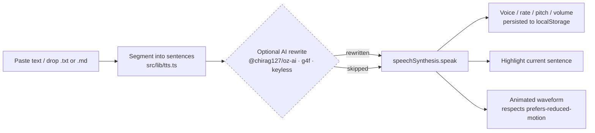

# oriz-tts

> Text-to-speech in your browser — pick a voice, dial rate & pitch, watch each sentence light up as it's spoken. 100% client-side, no upload, no signup.

[](./LICENSE)
[](https://github.com/chirag127/oriz-tts/stargazers)
[](https://github.com/chirag127/oriz-tts/commits/main)
[](https://github.com/chirag127/oriz-tts/actions/workflows/deploy.yml)
[](https://astro.build)

**Live app:** https://tts.oriz.in · **About / info:** https://chirag127.github.io/oriz-tts/ · **LLM data:** https://tts.oriz.in/llms.txt · **Repo:** https://github.com/chirag127/oriz-tts

> ⭐ If this is useful, please **star the repo** — it helps others find it.

## What it is

Paste text, pick a voice, dial in rate/pitch/volume, and hear it read aloud — each sentence highlighting as it's spoken with a neon waveform pulsing in time. It runs entirely on the native `window.speechSynthesis` API using the voices already installed on your device.

**100% client-side, no upload, no signup, free.** No text leaves the browser; no account, no key, no server. It exists because most "TTS" web tools ship your text to a paid cloud API — this one just drives the speech engine that's already in your OS.

## How it works



Everything happens in the browser tab. The optional AI-rewrite path degrades gracefully — if the keyless g4f providers are unavailable, core TTS still works.

## Features

- Native Web Speech synthesis — every system voice/language, zero downloads
- Voice, rate, pitch, volume controls (radio-console knobs), persisted to `localStorage`
- Highlight-as-spoken sentence tracking
- Animated waveform synced to playback (respects `prefers-reduced-motion`)
- Drag-drop or load a `.txt`/`.md` file
- Word/char count + spoken-duration estimate
- Optional AI rewrite (natural speech / reading level) via `@chirag127/oz-ai` (g4f multi-provider failover, no key) — degrades gracefully; core TTS always works
- Pause / resume / stop transport
- PWA-installable, works offline

> MP3 export is intentionally omitted: the browser SpeechSynthesis API exposes no audio stream, so reliable client-side audio capture isn't possible without a server. This tool stays 100% local instead.

## Tech stack

- **Astro** (`output: static`) + **React 19** islands + **Tailwind v4**
- **@vite-pwa/astro** — installable PWA, offline shell
- Shared atomic `@chirag127/*` packages for mechanism: `oz-tokens-base`, `oz-chrome`, `oz-file`, `oz-ai` (g4f client-side AI, multi-provider failover, no key)
- Bespoke "sound console" theme (deep indigo + neon cyan) for this site's identity
- **vitest** for pure-logic tests (segmentation, settings, estimates)

## Repo structure

```
src/
  components/   Knob.tsx · TtsStudio.tsx · Waveform.tsx   # React islands
  lib/tts.ts                                              # segmentation + speech engine
  layouts/Base.astro · pages/index.astro                 # Astro shell
  styles/                                                 # console / theme / global CSS
gh-info/index.html   # GitHub Pages "about" landing (chirag127.github.io/oriz-tts)
tests/               # vitest logic tests
public/              # icons, manifest, robots, llms.txt
```

## Quick start

```bash
npm install --legacy-peer-deps
npm run dev      # local dev (astro dev)
npm test         # vitest — pure logic (segmentation, settings, estimates)
npm run build    # static build → dist/
npm run deploy   # build + wrangler pages deploy (Cloudflare)
```

## Configuration

No configuration required. TTS uses your device's built-in voices; the optional AI rewrite runs keyless via g4f. There are no environment variables and nothing to sign up for.

## Part of the oriz family

`oriz-tts` is one of ~80 small, single-purpose sites in the **oriz** fleet — each a focused, client-side, free tool under a `*.oriz.in` domain. See how the fleet is built and run at **[blog.oriz.in](https://blog.oriz.in)**.

**Cost:** $0 on the Cloudflare Pages free tier. No backend, no database, no per-request cost.

## Contributing

Issues and PRs welcome. Keep the tool 100% client-side — no feature should require a server or a key. Conventional commits, please.

## Status

Stable. Actively maintained as part of the oriz fleet.

## Changelog

Conventional commits are the changelog — see the commit history.

## License

MIT © 2026 Chirag Singhal · chirag@oriz.in
