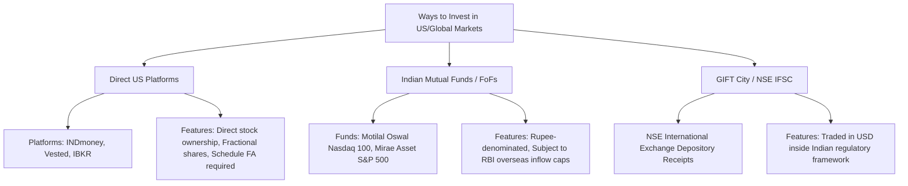

# Indian Markets vs. US Stocks: The Complete Investor Guide

An in-depth analysis for Indian investors on whether investing purely in the Indian stock market is sufficient, or whether adding US and global equities is essential for long-term wealth creation, risk mitigation, and currency hedging.

---

## Executive Summary

* **Is the Indian market enough?** For wealth accumulation in early career stages or small portfolios (< ₹5–10 Lakhs), **yes**. India's domestic growth trajectory, demographic dividend, and simple tax compliance make it an exceptional core wealth engine.
* **Why add US stocks?** If your portfolio is growing (> ₹10 Lakhs) or you want comprehensive risk management, **no single domestic market is 100% sufficient**. Adding **10% to 25% US/global exposure** gives you access to tech monopolies not present on Indian exchanges, provides a **3–4% annual currency tailwind** via USD appreciation, and insulates your net worth from country-specific geopolitical and regulatory risks.

---

## 1. Head-to-Head Comparison

| Metric / Dimension | Indian Equities (Nifty 50 / BSE 500) | US Equities (S&P 500 / Nasdaq 100) |
| :--- | :--- | :--- |
| **Primary Growth Driver** | Domestic consumption, manufacturing, infrastructure, credit penetration | Global innovation, tech dominance, enterprise software, AI/semiconductors |
| **Market Depth & Reach** | Top Indian companies earn most revenue domestically or in IT services | S&P 500 companies generate >40% of their revenue outside the US |
| **Currency Dynamics** | Tied directly to the Indian Rupee (INR) | Returns amplified by USD/INR depreciation (~3–4% p.a. historically) |
| **Sector Gaps** | Lacks pure-play AI models, semiconductors (fab & design), cloud infra, global SaaS | Deep ecosystem in semiconductors (Nvidia, TSMC), Big Tech, cloud, biotech |
| **Taxation in India** | STCG: 20%, LTCG: 12.5% (above ₹1.25L exemption) | STCG: Slab Rate (<24 mos), LTCG: 12.5% (without indexation, >24 mos) |
| **Operational Friction** | Zero remittance friction, seamless UPI/NetBanking, simple ITR-1/ITR-2 | LRS limits, TCS (20% above ₹10L), Schedule FA reporting in ITR |

---

## 2. The Case for Indian Markets Only (Domestic Strengths)

### 1. High Real GDP Growth & Demographic Dividend
India remains one of the fastest-growing major economies globally (projected at 6–7%+ annual real GDP growth). The expanding middle class, credit growth, and formalization of the economy provide a massive tailwind for domestic banking, consumer goods, automobiles, and infrastructure.

### 2. Zero Operational & Forex Friction
* Seamless instant investing via SIPs on Zerodha, Groww, Kuvera, Angel One, etc.
* No currency conversion spread, bank wire fees, or outward remittance paperwork.

### 3. Favorable Taxation & Easy Filing
* Equity mutual funds and listed stocks have clear tax brackets (LTCG at 12.5% on gains over ₹1.25 Lakhs per year).
* No complex foreign asset disclosures like Schedule FA.

---

## 3. Why 100% Domestic Bias is a Risk (The Case for US Equities)

### 1. The Innovation & Sector Gap
The Indian stock market indices are heavily weighted toward:
* **Financial Services / Banks** (~30–35%)
* **IT Services** (~12–15%)
* **Oil & Gas / Energy** (~10–12%)
* **FMCG & Auto** (~15%)

What is missing from Indian exchanges:
* **Semiconductor & Chip Design:** Nvidia, AMD, Broadcom, TSMC, ASML.
* **Global Cloud & Frontier AI:** Microsoft, Alphabet (Google), Amazon AWS, Meta.
* **Global Consumer Tech & Platforms:** Apple, Netflix, Uber, Booking Holdings.
* **Global Healthcare & Biotech Giants:** Eli Lilly, Novo Nordisk, Intuitive Surgical.

When you use ChatGPT, Google Search, Windows, an iPhone, AWS, or Instagram, you are generating revenue for US-listed companies. Holding only Indian stocks excludes you from participating in the profits of the tools you use daily.

### 2. The Currency Depreciation Tailwind
Historically, the Indian Rupee (INR) has depreciated against the US Dollar (USD) at an average rate of **~3% to 4% annually** over multi-decade periods.

$$\text{Total Realized INR Return} \approx \text{US Stock Return (USD)} + \text{USD/INR Appreciation Rate}$$

**Example:**
* If the S&P 500 returns **10% in USD**, and the USD strengthens against the INR by **3.5%** in that year:
* Your net return in INR terms is approximately **~13.5%**.

### 3. Geopolitical & Sovereign Risk Diversification
If 100% of your net worth (salary, real estate, bank deposits, and equities) is located within India:
* A local regulatory shift, sovereign credit event, or domestic economic slowdown impacts **every single bucket** of your wealth simultaneously.
* Allocating 15–20% globally ensures a safety buffer denominated in the world's primary reserve currency.

---

## 4. Taxation & Regulatory Framework for Indian Residents

### A. Capital Gains Tax on US Stocks (Post-Budget Updates)
Under Indian tax law, foreign shares are classified as **unlisted foreign securities**:

| Holding Period | Classification | Tax Rate in India |
| :--- | :--- | :--- |
| **Up to 24 Months** | Short-Term Capital Gains (STCG) | Taxed at your normal **Income Tax Slab Rate** |
| **More than 24 Months** | Long-Term Capital Gains (LTCG) | Flat **12.5%** (without indexation benefit) |

### B. Dividend Income & Double Taxation (DTAA)
* US companies withhold tax on dividends (usually **25%** under the India-US DTAA if Form W-8BEN is filed).
* In India, dividend income is added to your total income and taxed at your applicable slab rate.
* **Foreign Tax Credit (FTC):** You can offset the US-withheld tax against your Indian tax liability by filing **Form 67** prior to filing your ITR.

### C. Liberalised Remittance Scheme (LRS) & TCS
* **LRS Annual Limit:** Up to **$250,000 USD** per financial year per individual.
* **TCS (Tax Collected at Source):**
  * Remittances up to ₹10 Lakhs/year: **0% TCS** (for general investing routes under revised guidelines).
  * Remittances exceeding ₹10 Lakhs/year: **20% TCS**.
  * *Note:* TCS is not a tax loss; it is an advance tax credit that you can claim back in your ITR or adjust against your advance tax payments.

### D. Compliance: Schedule FA (Foreign Assets)
* Any Indian resident who holds direct foreign stocks, US ETFs, or cash in a foreign brokerage account **must disclose them in Schedule FA of ITR-2 or ITR-3**.
* Failure to disclose foreign assets attracts heavy penalties under the Black Money Act.

---

## 5. Investment Routes Available for Indian Investors

### 1. Direct Platforms (INDmoney, Vested, Interactive Brokers, Charles Schwab)
* **Best for:** Direct stock picking (e.g., buying Nvidia, Apple, Microsoft) and low-cost US ETFs (VOO, QQQ, VT).
* **Pros:** Fractional shares allowed, wide universe of stocks/ETFs.
* **Cons:** Requires outward remittance, Schedule FA reporting, potential bank wire charges.

### 2. Indian Mutual Funds / Fund-of-Funds (FoFs) & ETFs
* **Examples:** Motilal Oswal Nasdaq 100 ETF/Fund, Mirae Asset S&P 500 Top 50 ETF.
* **Best for:** Hands-off SIP investors who want zero LRS paperwork.
* **Pros:** Invest in INR via standard domestic demat/folio; no outward bank remittance needed.
* **Cons:** Inflows have periodically faced halts due to industry-wide RBI $7B overseas investment limit caps.

---

## 6. Recommended Portfolio Allocation Models

### Profile 1: The Beginner / Early Accumulator (Portfolio < ₹10 Lakhs)
* **Strategy:** Keep it simple; avoid outward remittance overhead.
* **Allocation:**
  * **90%–100%:** Indian Domestic Equities (Nifty 50 Index + Flexi Cap / Midcap Funds).
  * **0%–10%:** Indian-listed US FoF/ETF (if open for subscriptions).

---

### Profile 2: The Established Wealth Builder (Portfolio ₹10 Lakhs – ₹1 Crore)
* **Strategy:** Core & Satellite with meaningful international exposure.
* **Allocation:**
  * **75%–80%:** Indian Equities (Domestic growth engine).
  * **15%–20%:** US Broad Index (S&P 500 / Nasdaq 100 / Total US Stock Market).
  * **5%:** Gold / Sovereign Gold Bonds / Debt.

---

### Profile 3: The High-Net-Worth / Global Aspirant (Portfolio > ₹1 Crore)
* **Strategy:** Multi-currency, multi-geography diversification.
* **Allocation:**
  * **60%–70%:** Indian Equities & Domestic Real Assets.
  * **25%–30%:** US/Global Equities (via direct US Brokerage with S&P 500, Tech, and Global ETFs like VT/VXUS).
  * **5%–10%:** Cash equivalents, High-yield bonds, and Precious metals.

---

## 7. Conclusion: The Final Verdict

1. **Indian markets alone are sufficient to build substantial wealth**, provided you invest consistently in a diversified basket of low-cost funds.
2. **However, adding US stocks transforms a good portfolio into a resilient, all-weather global portfolio.**
3. A **15% to 20% allocation to US broad indices (S&P 500 / Nasdaq 100)** is the sweet spot: it gives you exposure to the world's most dominant companies, hedges against currency depreciation, and limits domestic geographic concentration without creating excessive tax complexity.

---

*Disclaimer: This guide is prepared for informational and educational purposes only and does not constitute financial, investment, or legal tax advice. Consult a SEBI-registered investment advisor (RIA) and a Chartered Accountant (CA) for personalized planning.*
